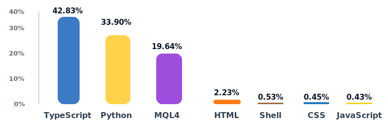

<h1>Hi There, I'm Nisha 👋</h1>

  Software builder focused on trading infrastructure, automation systems, and operational tooling.

I build software for **trading and business operations** across **bots, dashboards, data pipelines, reporting systems, and MT4/MT5 workflow tooling**.

My focus is on turning **manual, fragmented processes** into reliable systems that improve **visibility, speed, and operator efficiency**.

## Snapshot

- 📍 Dubai, UAE
- 🕒 GST / Dubai Time
- 💼 Python Automation
- 📊 Reporting Systems
- 🤖 Telegram Bots

## Skill Set

These are the areas and tools I work with most often:

### Core Areas

### Focus Areas

### Languages

| Python | TypeScript | JavaScript | SQL | Bash / Shell | MQL4 / MT4 |
| --- | --- | --- | --- | --- | --- |
|  Python |  TypeScript |  JavaScript |  SQL |  Bash / Shell |  |

### Frontend

| React | Next.js | Tailwind CSS | Radix UI | React Hook Form | Lightweight Charts |
| --- | --- | --- | --- | --- | --- |
|  React |  Next.js |  Tailwind |  |  |  |

### Backend

| FastAPI | Node.js | Uvicorn | SQLAlchemy | HTTPX | Telegram Bot APIs |
| --- | --- | --- | --- | --- | --- |
|  FastAPI |  Node.js |  |  |  |  |

### Data & Storage

| PostgreSQL | SQLite | pandas / openpyxl | asyncpg / aiosqlite | CSV / Excel | JSON |
| --- | --- | --- | --- | --- | --- |
|  PostgreSQL |  SQLite |  |  |  |  |

### Tools

| Git | GitHub | VS Code | npm | pnpm | Linux / VPS |
| --- | --- | --- | --- | --- | --- |
|  Git |  GitHub |  VS Code |  npm |  |  Linux / VPS |

| Axios | APScheduler | Alembic | Lucide React | next-themes | Vercel Analytics |
| --- | --- | --- | --- | --- | --- |
|  |  |  |  |  |  |

---

## Selected Work

### Public Work

#### Jagdamba Site

Professional web presence built with React and Next.js.

### Technical Work

#### Trading Infrastructure

Internal trading operations software covering dashboards, reconciliation, reporting, payment visibility, and MT4/MT5 execution support.

#### Market Monitoring

Real-time monitoring interfaces for spread tracking, premium analysis, charting, alert workflows, and operator-facing visibility.

#### Automation Systems

Bots, data pipelines, reporting utilities, and integration tooling for messaging, structured exports, execution support, and long-running operational jobs.

---

## GitHub Stats 📈

Public profile, repositories, live work, and active stack.

**Core Stack:** Python, TypeScript, JavaScript, SQL, MQL4  
**Focus:** Trading infrastructure, automation systems, dashboards, data pipelines, and reporting workflows  
**Public Signal:** Active public repositories, shipped work, and ongoing contribution activity

### Most Used Languages

Approx. based on tracked source files across current local project repos.

<picture>
  <source media="(prefers-color-scheme: dark)" srcset=".github-profile-assets/language-graph-v2-dark.svg" />
  <source media="(prefers-color-scheme: light)" srcset=".github-profile-assets/language-graph-v2.svg" />
  
</picture>

### Contribution Activity

<picture>
  <source
    media="(prefers-color-scheme: dark)"
    srcset="https://github-readme-activity-graph.vercel.app/graph?username=nishajangir&bg_color=0d1117&color=67e8f9&title_color=67e8f9&line=22c55e&point=f59e0b&area=true&hide_border=true"
  />
  <source
    media="(prefers-color-scheme: light)"
    srcset="https://github-readme-activity-graph.vercel.app/graph?username=nishajangir&bg_color=f8fafc&color=1f2937&title_color=0f172a&line=16a34a&point=f59e0b&area=true&hide_border=true"
  />
  
</picture>

---

## Let's Connect 🤝

