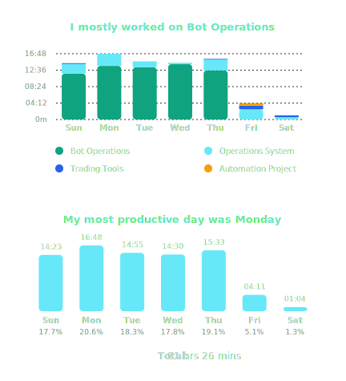
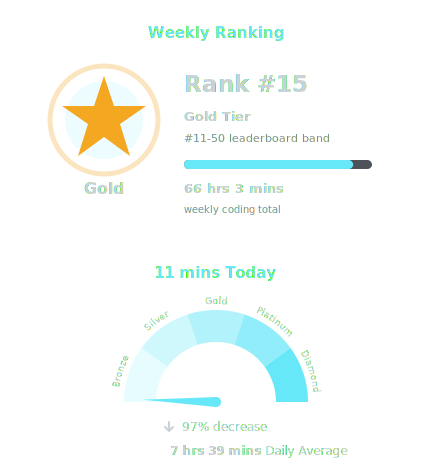
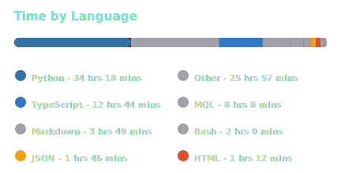

<h1>Hi There, I'm Nisha </h1>

> **Automation-focused software builder shipping trading infrastructure, bots, dashboards, and operational tooling.**

## About Me

I work across **trading infrastructure**, **business automation**, **data pipelines**, and **operator-facing tooling** — with a focus on systems that reduce manual work and improve day-to-day execution quality. My core work spans Telegram bots, reporting systems, reconciliation flows, internal dashboards, MT4/MT5 support tooling, and backend automation for business and trading operations.

Beyond operations tooling, I build frontend interfaces, backend services, and data workflows that turn fragmented processes into structured systems. My work usually sits at the intersection of execution speed, reporting clarity, and real-world operational reliability.

I'm open to serious collaboration around **trading operations software**, **automation systems**, **backend tooling**, **data infrastructure**, and **internal product engineering**.

  
  
  
  
  

## Coding Activity :stopwatch:

  <picture>
    <source media="(prefers-color-scheme: dark)" srcset="./profile/wakatime-merged-dark.svg" />
    <source media="(prefers-color-scheme: light)" srcset="./profile/wakatime-merged-light.svg" />
    
  </picture>
  <picture>
    <source media="(prefers-color-scheme: dark)" srcset="./profile/wakatime-rank-speed-dark.svg" />
    <source media="(prefers-color-scheme: light)" srcset="./profile/wakatime-rank-speed-light.svg" />
    
  </picture>

## Skill Set :muscle:

These are the areas and tools I work with most often:

**Languages**

<table>
  <tr>
    <td align="center"> Python</td>
    <td align="center"> TypeScript</td>
    <td align="center"> JavaScript</td>
    <td align="center"> SQL</td>
    <td align="center"> Bash</td>
    <td align="center"> HTML</td>
    <td align="center"> CSS</td>
    <td align="center"> MQL4</td>
  </tr>
</table>

**Core Domains**

  
  
  
  

**Operational Specialization**

  
  
  
  

**Trading & Workflow Systems**

  
  
  
  
 

**Automation & Reporting**

  
  
  
  

**Frontend**

<table>
  <tr>
    <td align="center"> React</td>
    <td align="center"> Next.js</td>
    <td align="center"> Tailwind</td>
    <td align="center"> Radix UI</td>
    <td align="center"> Vercel</td>
    <td align="center"> Charts</td>
  </tr>
</table>

**Backend**

<table>
  <tr>
    <td align="center"> FastAPI</td>
    <td align="center"> Node.js</td>
    <td align="center"> Uvicorn</td>
    <td align="center"> SQLAlchemy</td>
    <td align="center"> HTTPX</td>
    <td align="center"> Telegram</td>
  </tr>
</table>

**Data & Storage**

<table>
  <tr>
    <td align="center"> PostgreSQL</td>
    <td align="center"> SQLite</td>
    <td align="center"> CSV / Excel</td>
    <td align="center"> JSON</td>
    <td align="center"> pandas</td>
    <td align="center"> openpyxl</td>
  </tr>
</table>

**Libraries & Workflow Tooling**

  
  
  
  
  
  

**Tools**

<table>
  <tr>
    <td align="center"> Git</td>
    <td align="center"> Linux</td>
    <td align="center"> GitHub</td>
    <td align="center"> VS Code</td>
    <td align="center"> npm</td>
    <td align="center"> pnpm</td>
  </tr>
</table>

**Cloud & Infra**

  
  
  
  

## GitHub Stats :chart_with_upwards_trend:

  <picture>
    <source media="(prefers-color-scheme: dark)" srcset="./profile/stats-dark.svg" />
    <source media="(prefers-color-scheme: light)" srcset="./profile/stats-light.svg" />
    
  </picture>
  <picture>
    <source media="(prefers-color-scheme: dark)" srcset="https://streak-stats.demolab.com/?user=nishajangir&theme=github-dark-blue&hide_border=true&background=00000000&stroke=30363D&ring=67E8F9&fire=67E8F9&currStreakLabel=67E8F9&sideLabels=C9D1D9&dates=8B949E" />
    <source media="(prefers-color-scheme: light)" srcset="https://github-readme-streak-stats.herokuapp.com/?user=nishajangir&theme=default&hide_border=true&background=00000000&stroke=D0D7DE&ring=0F172A&fire=0F172A&currStreakLabel=0F172A&sideLabels=1F2937&dates=64748B" />
    
  </picture>

<picture><source media="(prefers-color-scheme: dark)" srcset="./profile/top-langs-dark.svg" /><source media="(prefers-color-scheme: light)" srcset="./profile/top-langs-light.svg" /></picture><picture><source media="(prefers-color-scheme: dark)" srcset="./profile/wakatime-dark.svg" /><source media="(prefers-color-scheme: light)" srcset="./profile/wakatime-light.svg" /></picture>

## Stargazers :earth_asia:

  

## Contribution Activity :zap:

  <a href="https://github.com/nishajangir">
    <picture>
      <source media="(prefers-color-scheme: dark)" srcset="https://github-readme-activity-graph.vercel.app/graph?username=nishajangir&bg_color=0d1117&color=c9d1d9&title_color=67e8f9&line=10a37f&point=f59e0b&area=true&area_color=0e7490&hide_border=true&custom_title=Contribution%20Activity" />
      <source media="(prefers-color-scheme: light)" srcset="https://github-readme-activity-graph.vercel.app/graph?username=nishajangir&bg_color=f8fafc&color=1f2937&title_color=0f172a&line=0e7490&point=f59e0b&area=true&area_color=10a37f&hide_border=true&custom_title=Contribution%20Activity" />
      
    </picture>
  </a>

**Selected Work**

- [jagdamba-site](https://github.com/nishajangir/jagdamba-site) — professional business website built with React and Next.js, deployed live on [jagdamba.site](https://www.jagdamba.site).
- [nishajangir](https://github.com/nishajangir/nishajangir) — automated GitHub profile repository with WakaTime cards, stats workflows, and stargazer mapping.
- Trading automation stack — internal dashboards, reconciliation flows, MT4/MT5 tooling, and Telegram bot systems for operator-facing workflows.

**Notable Open Source Repositories**

- [jagdamba-site](https://github.com/nishajangir/jagdamba-site) — public website repository for a production React and Next.js web presence.
- [nishajangir](https://github.com/nishajangir/nishajangir) — profile automation repository using GitHub Actions, stats cards, and custom README assets.

## Let's Connect :handshake:

